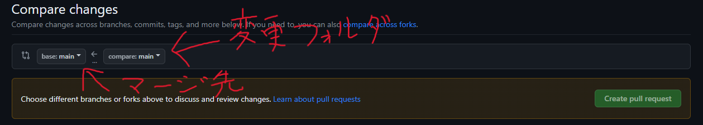

# 動物専用SNS Animit

## Git運用手順

`origin`: デフォルトのリポジトリの場所(URL)の別名

|ブランチ名   | 説明                                         |
|------------|----------------------------------------------|
|`main`      | 安定版ブランチ(絶対動くものを置く場所)           |
|`develop`   | 開発用ブランチ(大体のものはここにマージ・プルする)|  
|`feature`   | 新機能ブランチ                                 |
|`hotfix`    | バグ修正ブランチ                               |

- ### 初めてのGit

    1. ローカルにリポジトリを新規作成する
    2. リモートリポジトリとローカルリポジトリの紐づけ
    3. 最新のmainブランチをダウンロード

    ```git
    git init
    git remote add origin https://github.com/NicoSoup/Animit
    git clone origin main
    ```

    - #### cloneとpullの違い  

        `clone`: ファイルを全てコピーする  
        `pull`: ローカル側とリモート側で、差異がある(更新されている)ファイルを全てコピーする

- ### 作業はじめ

    1. リモートリポジトリの履歴をローカルに更新
    2. リモートリポジトリのmainブランチから差分をダウンロード

    ```git
    git fetch origin develop       //なくても良い
    git pull origin develop
    ```

- ### リモートへのマージまでの流れ

    1. #### 現在のディレクトリのすべての変更をステージングエリアに追加

        ```git
        git add .
        ```

        #### または

        #### 特定のファイルをステージングエリアに追加

        ```git
        git add <ファイル名>
        ```

    2. #### ステージングされた変更をリポジトリにコミット(`-m`オプションのあとはコミットメッセージ、変更内容)

        ```git
        git commit -m "[example]"
        ```

    3. #### ローカルからリモートにプッシュ

        ```git
        git push origin feature
        ```

    4. #### [github](https://github.com/NicoSoup/Animit/pulls)上から **`New pull request`**
        

    5. #### 他のメンバーがレビュー

        

    6. #### マージ

        

## dbフォルダがない場合

以下のリンクから
[dbデータをダウンロード](https://google.com)  
ダウンロードしてきたフォルダをプロジェクト直下に配置

- ### .gitkeepの削除

    dbフォルダ内から.gitkeepを削除する

    ```sh
    rm db/dbdate/*/.gitkeep
    ```

- ### データベースの反映

    ```bash
    python manage.py makemigrations animit
    ```  

    ```bash
    python manage.py migrate
    ```

## 簡易サーバーでのデバック

- ### ターミナルに接続

    djangoコンテナに接続

    ```docker
    docker-compose exec django /bin/bash
    ```  

    実行後→```root@(コンテナ名):/code#```

- ### 簡易サーバーの起動

    djangoの機能、簡易webサーバーを起動する

    ```bash
    python manage.py runserver
    ```

    コード内にprint()文を記述すればdjangoコンテナのログに出力される

## webサイトを立ち上げる方法

- ### 起動方法

    docker-composeファイルからイメージ、コンテナを作成する

    ```docker
    docker-compose up -d
    ```

- ### ターミナルに接続

    ```docker
    docker-compose exec django /bin/bash
    ```  

    ターミナル結果→```root@(コンテナ名):/code#```

- ### 変更を反映される方法

    ```docker
    docker-compose restart
    ```

- ### Django管理サイトLogin

    URL:
    ```localhost/admin/```

    ユーザー名:
    ```root```

    Password:
    ```Temporary_password```

## docker-compose ファイルの概要

|command                |   概要                                                             |
|-----------------------|--------------------------------------------------------------------|
|version                |   docker-compose.yml のバージョンを指定する。                        |
|services               |   起動するサービス群。ネストした要素でコンテナを定義する。              |
|container_name         |   任意の名前（例：mysample, busybox）                               |
|image                  |   イメージからコンテナ生成する場合、イメージ（リポジトリ:タグ）を指定する|
|command                |   コンテナ起動時に実行するコマンドを設定する。                         |
|volumes                |   ローカルとコンテナでファイルを同期する                              |
|environment            |   環境変数を設定する                                                |
|build                  |   Dockerfileのディレクトリを指定する                                 |
|ports                  |   ポート転送を指定する                                              |
|depends_on             |   依存関係を設定する                                                |
